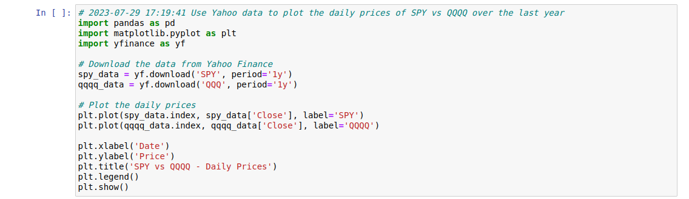

## notebook_whisperer
A coding assistant to help with the construction of Jupyter notebooks

Do you ever have trouble remembering how to download a dataset?  How to
fit a particular model?  How to check for significance?  How to make
a beautiful plot of your data?

If the answer to any of the above is yes, then the Notebook Whisperer may be
for you.  With the Notebook Whisperer, you can enter a short sentence saying
what you would like to do.  It then populates the next cell in your Jupyter
notebook with the code for performing that task.  This is accomplished by
sending the contents of your notebook to chatGPT and having it provide the
code that it thinks will fulfill your request.

Here is an example session using the Notebook Whisperer.

#### Download

To download and install this module, do the following:

```
pip install git+https://github.com/matthewclegg/notebook_whisperer.git
```

Now launch your Jupyter server as you normally do, e.g.,

```
jupyter notebook
```

#### Initialization


By default, the Notebook Whisperer obtains the API key from the environment
variable OPENAPI_API_KEY.  However, it can be explicitly set by using the
`api_key` parameter of the `start_helper()` function.

To obtain an API key from OpenAI, visit the following page:

[OpenAI API Key Management page](https://platform.openai.com/account/api-keys)

#### Ask the Notebook Whisperer for help in coding:


In this example, we are asking the Notebook Whisperer to provide us with the
code for plotting the price of the S&P 500 index versus that of the NASDAQ index.
A short while after executing this cell, the following code was populated into
the next cell of my notebook:



To see the results of executing this code, simply click in the cell containing
the code and press control-enter.  When I did this, the following plot was
displayed:


Here is an example of a follow-up request:


Note that the Notebook Whisperer was able to make use of the timeseries data that
was downloaded in the previous step.

It is also possible to make regular text-based queries to OpenAI through the
Notebook whisperer.  Note that when making such queries, one should use the `ask()`
method.


Here is one last example:


There is one small gotcha to be aware of.  Each time you call the function `assist()`,
a new cell is inserted into the notebook with the proposed code.  Consequently, if you
get an answer to `assist()` that you like, you may want to comment out the call to it
so that the notebook does not get populated with many repeat answers.

That's it!  If you like this code or if you have questions or suggestions, please
drop me an email at matthewcleggphd@gmail.com.


